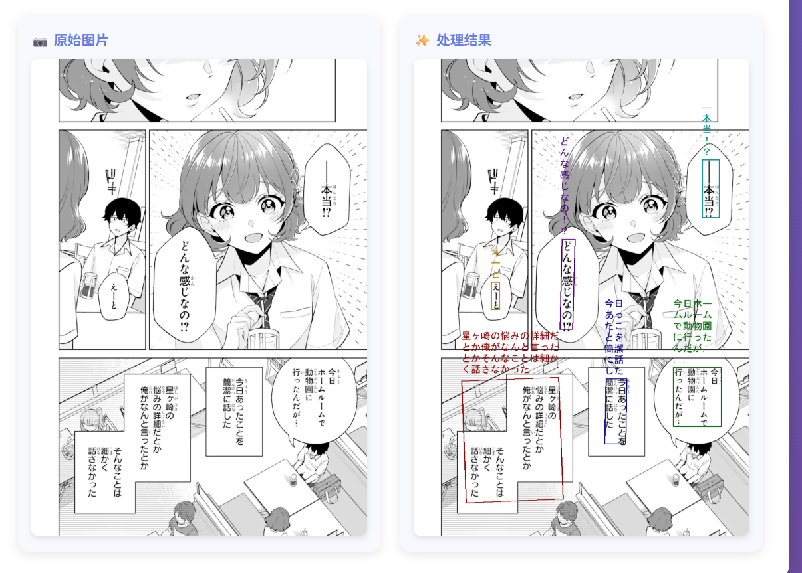

# Paddle OCR Service

基于FastAPI的OCR文本检测与识别服务，集成了PaddleOCR和MangaOCR模型，提供文本检测和识别的REST API接口。

## 功能特性

- 文本检测：使用PaddleOCR的PP-OCRv5模型进行文本区域检测
- 文本识别：使用MangaOCR模型进行文本内容识别

## 模型说明

### PaddleOCR模型
基于PP-OCRv5_mobile_det根据数据集Manga109-s进行微调，在测试集上对文本区域检测的准确率为85%。

**模型存储**：文本检测模型（PP-OCRv5_mobile_det）已存储在本仓库中，位于 `models/detector/PP-OCRv5_mobile_det/` 目录，无需额外下载。

### MangaOCR模型
本项目使用的MangaOCR模型来自开源项目 [kha-white/manga-ocr](https://github.com/kha-white/manga-ocr)。

模型下载与部署请参考：https://github.com/kha-white/manga-ocr

## 技术栈

- **Web框架**: FastAPI
- **OCR引擎**: PaddleOCR, MangaOCR
- **图像处理**: Pillow, OpenCV
- **深度学习**: PyTorch, PaddlePaddle
- **HTTP客户端**: httpx

## 安装说明

### 环境要求

- Python 3.10+
- Conda环境

### 安装步骤

1. 克隆项目到本地

2. 创建并激活conda环境（如果还没有环境）：
```bash
conda create -n paddle_ocr python=3.10
conda activate paddle_ocr
```

3. 安装依赖包：
```bash
pip install -r requirements.txt
```

4. 模型文件说明：
- 文本检测模型：PP-OCRv5_mobile_det（已包含在仓库中，位于 `models/detector/PP-OCRv5_mobile_det/`）
- OCR识别模型：manga-ocr-base（需自行下载，参考：https://github.com/kha-white/manga-ocr）

将下载的MangaOCR模型文件放置在 `models/ocr/manga_ocr/` 目录中。

## 使用方法

### Web演示界面

本项目提供了一个基于Web的交互式演示界面 `web_demo.py`，支持上传图片并实时显示OCR识别结果。

**功能特性**：
- 支持图片上传
- 自动检测文本区域
- 识别文本内容
- 在原图上绘制文本框和识别结果
- 使用不同颜色区分不同的文本区域

**启动方式**：

```bash
python web_demo.py
```

启动后访问 `http://127.0.0.1:8000` 即可使用Web演示界面。

**使用步骤**：
1. 在浏览器中打开 `http://127.0.0.1:8000`
2. 点击上传按钮选择图片
3. 等待处理完成
4. 查看带有文本标注的识别结果

### 演示效果图



### API服务

#### 启动服务

```bash
uvicorn main:app --host 0.0.0.0 --port 8000
```

### API接口

#### 1. 文本检测

**接口**: `POST /detect`

**请求参数**:
```json
{
  "url": "图片URL地址"
}
```

**返回结果**:
```json
{
  "detections": [
    {
      "dt_polys": [[x1, y1], [x2, y2], [x3, y3], [x4, y4]],
      "dt_scores": 0.95
    }
  ]
}
```

#### 2. 文本识别

**接口**: `POST /ocr`

**请求参数**:
```json
{
  "url": "图片URL地址",
  "detections": "文本检测结果JSON字符串"
}
```

**返回结果**:
```json
{
  "detections": {
    "dt_polys": [...],
    "dt_scores": [...],
    "dt_text": ["识别的文本1", "识别的文本2"]
  }
}
```

### 使用示例

#### Python示例

```python
import requests
import json

# 文本检测
detect_url = "http://localhost:8000/detect"
detect_response = requests.post(detect_url, json={
    "url": "https://example.com/image.jpg"
})
detections = detect_response.json()

# 文本识别
ocr_url = "http://localhost:8000/ocr"
ocr_response = requests.post(ocr_url, json={
    "url": "https://example.com/image.jpg",
    "detections": json.dumps(detections)
})
result = ocr_response.json()
print(result)
```

#### curl示例

```bash
# 文本检测
curl -X POST "http://localhost:8000/detect" \
  -H "Content-Type: application/json" \
  -d '{"url": "https://example.com/image.jpg"}'

# 文本识别
curl -X POST "http://localhost:8000/ocr" \
  -H "Content-Type: application/json" \
  -d '{"url": "https://example.com/image.jpg", "detections": "{\"detections\": [...]}"}'
```

## 配置说明

在 `config.py` 中可以配置模型路径和设备：

```python
# 文本检测模型配置
DETECTOR_MODEL_NAME = "PP-OCRv5_mobile_det"
DETECTOR_MODEL_PATH = "./models/detector/PP-OCRv5_mobile_det"
DETECTOR_MODEL_DEVICE = "cpu"  # 可选: "cpu" 或 "cuda"

# OCR识别模型配置
OCR_MODEL_NAME = "kha-white/manga-ocr-base"
OCR_MODEL_PATH = "./models/ocr/manga_ocr"
OCR_MODEL_DEVICE = "cpu"  # 可选: "cpu" 或 "cuda"
```

## 注意事项

1. 文本检测模型已包含在仓库中，可直接使用
2. MangaOCR模型需自行下载，请参考 https://github.com/kha-white/manga-ocr
3. 图片URL需要是可公开访问的地址
4. 建议使用GPU加速以提高处理速度
5. 确保网络连接正常，用于下载图片和模型

## 许可证

本项目仅供学习和研究使用。

## 贡献

欢迎提交Issue和Pull Request！
